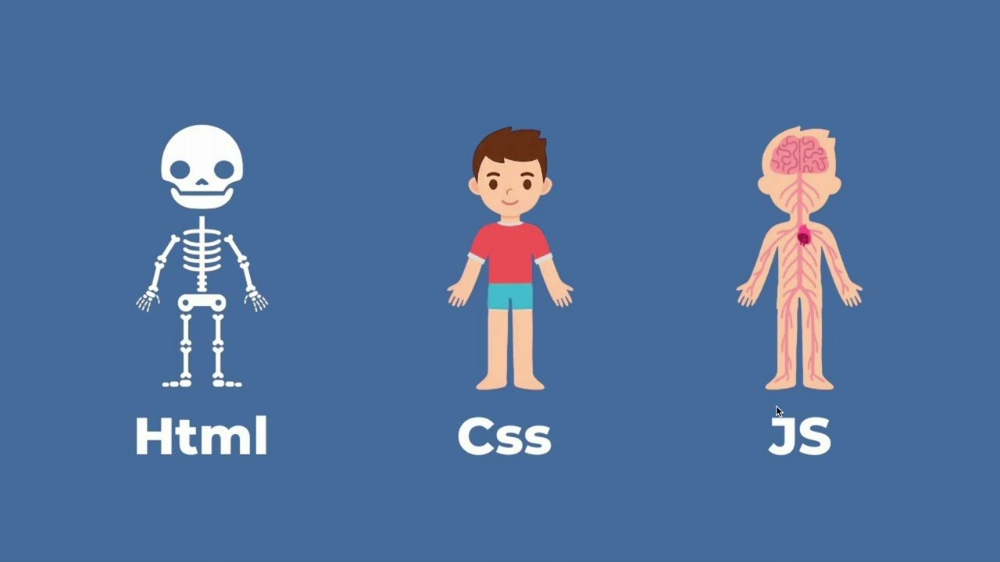

# Introducción al desarrollo web

---

**🎯 Objetivos del capítulo**

> - Comprender qué es el desarrollo web y sus áreas principales
> - Conocer las tecnologías fundamentales: HTML, CSS y JavaScript
> - Configurar tu entorno de desarrollo
> - Crear tu primera página web
> - Entender la estructura básica de un proyecto web

---

## ¿Qué es el desarrollo web?

Cada día accedemos a cientos de páginas web: redes sociales, buscadores, tiendas online, servicios de streaming... Todas estas experiencias digitales son el resultado del **desarrollo web**, una *disciplina que combina creatividad, lógica y tecnología para crear sitios y aplicaciones que funcionan en Internet*.

Cuando visitas una página web, tu navegador descarga archivos desde un servidor y los interpreta para mostrarte contenido. Escribes una URL, presionas Enter, y en fracciones de segundo tu ordenador se comunica con servidores en cualquier parte del mundo para traerte esa información.

### Frontend y Backend

El **desarrollo web** se divide en dos áreas complementarias:

**Frontend** es todo lo que sucede en tu navegador: **lo que ves** y con lo que interactúas. Cuando haces clic en un botón, cuando se despliega un menú, cuando cambia el color de un enlace... todo eso es frontend. Las tecnologías principales son:

* HTML
* CSS
* JavaScript

**Backend** es lo que ocurre en los servidores, "detrás del escenario". Cuando inicias sesión en una red social, el backend verifica tus credenciales en una base de datos. Cuando compras algo online, el backend procesa el pago. Se programa con lenguajes como:

* PHP  
* Python  
* Node.js  
* SQL  

## Las tres tecnologías fundamentales del Frontend

{width=35% align="right"}

Si el desarrollo web fuera construir una casa, **HTML** sería la estructura (paredes, puertas, ventanas), **CSS** la decoración (pintura, muebles), y **JavaScript** la instalación eléctrica (luces, automatizaciones). Veamos cada una.

### HTML: La estructura y el contenido

**HTML** (HyperText Markup Language) es el lenguaje que utilizamos para decirle al navegador **qué contenido queremos mostrar y cómo está organizado**. No es un lenguaje de programación, sino un lenguaje de **marcado**: "etiquetamos" el contenido para indicar qué es cada cosa.

Por ejemplo, en lugar de simplemente escribir "Título" y hacerlo grande, en HTML escribimos:

*Haz clic en las distintas pestañas siguientes*
=== "Código HTML"
    ```html linenums="1" hl_lines="1 2 3"
    <h3>Esto es un título de nivel 3</h3>
    <p>Esto es <strong>muy importante</strong></p>
    <a href="https://www.google.com">Esto es un enlace a Google</a>
    ```

=== "Ver resultado *(click para expandir)*"
    <div style="background-color: #f8f8f8ff; padding: 20px;">
    <h3>Esto es un título de nivel 3</h3>
    <p>Esto es <strong>muy importante</strong></p>
    <a href="https://www.google.com">Esto es un enlace a Google</a>
    </div>

Las palabras entre `< >` son **etiquetas** que le dicen al navegador: "esto es un título", "esto es un párrafo" o "esto es una imagen". HTML es la base de toda página web. Sin HTML, no hay contenido que mostrar.

### CSS: El diseño visual

**CSS** (Cascading Style Sheets) decide **cómo se ve** la estructura HTML: colores, tamaños, espacios, posiciones... todo lo visual. Con solo HTML, una página se ve muy básica (texto negro sobre fondo blanco). CSS la transforma en algo atractivo.

Funciona mediante **reglas** que le dicen al navegador cómo debe verse cada elemento:

=== "Código CSS"
    ```html linenums="1" hl_lines="2 3"
    <!-- Las dos primeras líneas son CSS -->
    h3 {color: blue; font-size: 32px;}
    p {color: gray; line-height: 1.6;}

    <!-- Esta líneas son HTML -->
    <h3>Esto es un título de nivel 3</h3>
    <p>Esto es muy un párrafo</p>
    ```
=== "Ver resultado *(click para expandir)*"
    <div style="background-color: #f8f8f8ff; padding: 20px;">
    <h3 style="color: blue; font-size: 32px;">Esto es un título de nivel 3</h3>
    <p style="color: gray; line-height: 1.6;">Esto es muy un párrafo</p>
    </div>

> CSS no cambia el contenido, **solo cambia cómo se ve**. También permite hacer diseños responsive que se adaptan a móviles, tablets y ordenadores.

### JavaScript: La interactividad

JavaScript es un lenguaje de programación real que añade **comportamiento dinámico** a las páginas. ¿Un formulario que valida datos al instante? ¿Notificaciones que aparecen? ¿Contenido que se actualiza sin recargar? Todo eso es JavaScript.

=== "Código JavaScript"
    ```javascript linenums="1" hl_lines="2 3"
    // Ejemplo simple: mostrar una alerta al hacer clic en un botón
    button.addEventListener('click', function() {
        alert('¡Gracias por hacer clic!');
    });
    ```
=== "Ver resultado *(click para expandir)*"
    <div style="text-align:center; background-color: #f8f8f8ff; margin:20px; padding: 20px;">
    <button id="miBoton"
            style="background-color:#ccc;
                    color:black;
                    border:none;
                    padding:10px 20px;
                    border-radius:8px;
                    cursor:pointer;
                    font-size:16px;">
        Haz clic aquí
    </button>
    <script>
        const button = document.getElementById('miBoton');
        button.addEventListener('click', function() {
        alert('¡Gracias por hacer clic!');
        });
    </script>
    </div>

> JavaScript permite crear experiencias interactivas y dinámicas que mejoran la usabilidad y funcionalidad de una página web. 
 
En este curso nos centraremos en **HTML** y **CSS**. JavaScript lo verás más adelante, ya que es importante dominar primero la estructura y el diseño.

---

## Configurando tu entorno de desarrollo

Antes de programar necesitas las herramientas adecuadas. Los desarrolladores profesionales usan programas especializados que facilitan el trabajo.

### Visual Studio Code

VS Code es el editor de código más popular del mundo. Es gratuito, potente, y tiene características que ahorran tiempo:

- **Resaltado de sintaxis**: colorea el código para mejor lectura
- **Autocompletado**: sugiere código mientras escribes
- **Detección de errores**: avisa cuando algo está mal
- **Extensiones**: añade funcionalidades extra

**Instalación:**

1. Ve a [code.visualstudio.com](https://code.visualstudio.com/)
2. Descarga e instala
3. Instala estas extensiones esenciales:
   - **Live Server**: actualiza tu página automáticamente al guardar cambios
   - **HTML CSS Support**: mejora el autocompletado
   - **Prettier**: formatea tu código automáticamente

### DevTools del navegador

Todos los navegadores incluyen **DevTools**, herramientas que permiten inspeccionar y modificar el código de cualquier página en tiempo real. Presiona `F12` para abrirlas.

Con DevTools puedes:

- Ver el HTML y CSS de cualquier página
- Modificar código en tiempo real para experimentar
- Detectar errores
- Probar diferentes tamaños de pantalla

Usa **Chrome** o **Firefox** como navegador principal para desarrollo.

## Tu primera página web

Vamos a crear tu primera página web ahora mismo.

### Pasos:

1. **Crea una carpeta** llamada `mi-primera-web`
2. **Abre VS Code** y abre esa carpeta (`Archivo > Abrir carpeta`)
3. **Crea un archivo** llamado `index.html`
   * **¡Todo sitio web debe tener un `index.html`! Será el "landing page" del sitio web**
4. **Escribe este código:**

!!! tip "Atajo en VS Code"
    Escribe `!` y presiona `Tab` para generar automáticamente esta estructura.  


=== "Código HTML"
    ```html linenums="1"
    <!DOCTYPE html>
    <html lang="es">
    <head>
        <meta charset="UTF-8">
        <meta name="viewport" content="width=device-width, initial-scale=1.0">
        <title>Mi Primera Página Web</title>
    </head>
    <body>
        <h1>¡Hola, mundo!</h1>
        <p>Esta es mi primera página web.</p>
        <p>Estoy aprendiendo HTML y CSS en 2º de Bachillerato.</p>
    </body>
    </html>
    ```
=== "Ver resultado renderizado *(click para expandir)*"
    <div style="background-color: #f8f8f8ff; padding: 20px;">
        <p style="font-size: 2em">¡Hola, mundo!</p>
        <p>Esta es mi primera página web.</p>
        <p>Estoy aprendiendo HTML y CSS en 2º de Bachillerato.</p>
    </div>


1. **Para verla en el navegador:**
   - **Opción 1**: Haz doble clic en `index.html` desde tu explorador de archivos
   - **Opción 2** (recomendado): En VS Code, clic derecho > "Open with Live Server" (si no está instalado, hazlo desde la opción **Extensiones**)

¡Felicidades! Has creado tu primera página web.


## Estructura de carpetas y archivos de un proyecto web

A medida que tus proyectos crezcan, necesitas organización. Esta es la estructura recomendads:

```bash
mi-proyecto/
├── index.html
├── sobre-mi.html
├── ... .html
├── css/
│   └── styles.css
├── js/
│   └── app.js
├── img/
│   ├── logo.png
│   ├── foto.jpg
│   └── ... .jpg
└── README.md
```


- **Archivos HTML en la raíz**
- **Carpeta `css/`** para estilos
- **Carpeta `js/`** para JavaScript
- **Carpeta `img/`** para imágenes
- **README.md** para documentación o instrucciones.

---

## 🎯 Ejercicios prácticos

### Ejercicio 1: Explorar sitios web 🟢

1. Abre tu página favorita
2. Presiona `F12` para abrir DevTools
3. Explora la pestaña "Elements"
4. Haz clic en diferentes elementos y observa su HTML y CSS
5. Intenta modificar algún texto o color (los cambios son temporales)

### Ejercicio 2: Personalizar tu página 🟢

Modifica tu `index.html` para incluir:

1. Un título con tu nombre
2. Un subtítulo "Sobre mí"
3. Tres párrafos sobre ti: quién eres, qué estudias, qué te gusta
4. Otro subtítulo "Mis aficiones"
5. Tres párrafos sobre tus hobbies

---

**🔀 ¿Y ahora qué...?**


!!! abstract "⬅️ capítulo anterior"
    En la [**Presentación del curso**](docs/index.md) conocerás la estructura del curso,  
    los materiales disponibles y cómo trabajar con los recursos que vas a utilizar a lo largo de los capítulos.

---

!!! question "Refuerza lo aprendido 💪"
    Si quieres afianzar los contenidos de este apartado, realiza los ejercicios del capítulo:  
    👉 [**Capítulo 1 — Ejercicios de Introducción**](../ejercicios/introduccion-ejercicios.md)

---

!!! abstract "➡️ capítulo siguiente"
    En el [**Capítulo 2 — HTML Básico**](02-html-basico.md) aprenderás en detalle **todas las etiquetas esenciales de HTML**  
    y cómo crear contenido estructurado correctamente.

---
