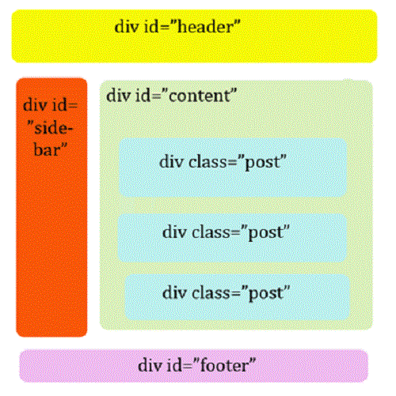
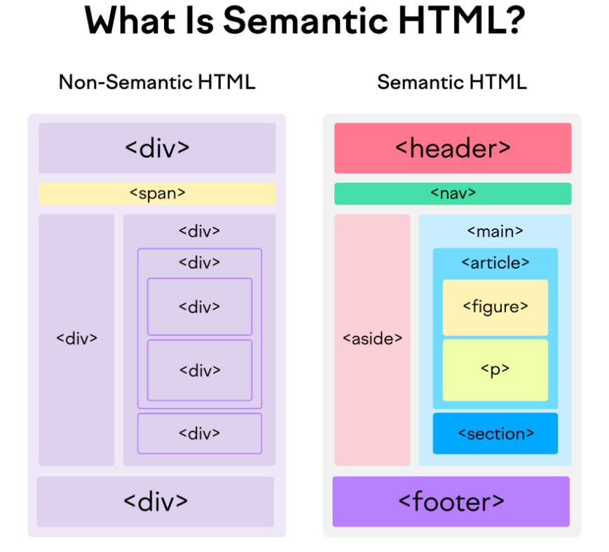

# Estructura semántica HTML5

---
**🎯 Objetivos del capítulo**

- Crear la estructura básica de una página HTML válida.
- Utilizar etiquetas semánticas correctamente.
- Estructurar contenido con elementos semánticos.
---

## HTML vs. HTML5

Antes de HTML5, **la mayoría de los desarrolladores utilizaban únicamente las etiquetas `<div>` y `<span>`** para estructurar y dar formato a las páginas web, ya que **no existían etiquetas semánticas** que indicaran el propósito o significado del contenido.

Estas dos etiquetas servían principalmente como **contenedores genéricos**, que podían ser **estilizados mediante atributos o reglas CSS** para componer la apariencia visual del sitio.

Sin embargo, su gran limitación era que **no aportaban información semántica**: los navegadores, buscadores y tecnologías de asistencia no podían distinguir si un `<div>` representaba un encabezado, una sección de contenido, una barra lateral o un pie de página.

| Etiqueta | Tipo     | Uso principal                                       | Ejemplo                                     |
| -------- | -------- | --------------------------------------------------- | ------------------------------------------- |
| `<div>`  | Bloque   | Agrupar grandes secciones de contenido              | `<div id="header">...</div>`                |
| `<span>` | En línea | Aplicar estilo o agrupar texto dentro de un párrafo | `<span class="resaltado">importante</span>` |

Por ejemplo, antes de HTML5, una página podía verse así:
{width=40% align=right} 

```html
<div id="header">Encabezado</div>

<div id="sidebar">
  <!-- Estos dos menús NO aparecen el la imagen de la derecha -->
  <span id="menu1">Menú principal</span><br>
  <span id="menu2">Menú secundario</span>
</div>

<div id="content">
  <!-- Estas tres secciones NO aparecen el la imagen de la derecha -->
  <div class="post">Artículo 1</div> 
  <div class="post">Artículo 2</div> 
  <div class="post">Artículo 3</div> 
</div>

<div id="footer">Pie de página</div>
```

Con la llegada de HTML5, estas estructuras fueron reemplazadas por **etiquetas semánticas** como `<header>`, `<nav>`, `<main>`, `<section>` y `<footer>`, que además de organizar visualmente el contenido, **expresan su función dentro del documento**, mejorando el **SEO**, la **accesibilidad** y la **legibilidad del código**.

### Comparación

<div class="grid cards" markdown>

-   __Estructura No Semántica__

    ---
    ```html
    <!-- Estructura no semántica -->
    <div id="header">
    <h1>Mi sitio web</h1>
    <span id="menu">
        <a href="#">Inicio</a>
        <a href="#">Servicios</a>
        <a href="#">Contacto</a>
    </span>
    </div>

    <div id="content">
    <div class="article">
        <h2>Título del artículo</h2>
        <p>Contenido del artículo...</p>
    </div>
    </div>

    <div id="footer">
    <p>© 2025 Mi Sitio Web</p>
    </div>
    ```

-   __Estructura Semántica__

    ---

    ```html
    <!-- Estructura semántica con HTML5 -->
    <header>
    <h1>Mi sitio web</h1>
    <nav>
        <a href="#">Inicio</a>
        <a href="#">Servicios</a>
        <a href="#">Contacto</a>
    </nav>
    </header>

    <main>
    <article>
        <h2>Título del artículo</h2>
        <p>Contenido del artículo...</p>
    </article>
    </main>

    <footer>
    <p>© 2025 Mi Sitio Web</p>
    </footer>
    ```
</div>

👀 **Problemas de la Estructura No Semántica:**

* El código **no transmite significado**.
* Los buscadores y lectores de pantalla **no pueden interpretar** la estructura.
* Es **difícil de mantener**.

✅ **Ventajas de la Estructura Semántica:**

* Estructura más **clara y legible**.
* Mejora el **SEO** (los motores de búsqueda entienden jerarquías).
* Facilita la **accesibilidad** (narradores pueden identificar roles).
* Código más **mantenible y profesional**.


#### Comparación visual resumida

| Elemento NO semántico   | Elemento semántico     | Significado             |
| ----------------------- | ---------------------- | ----------------------- |
| `<div id="header">`     | `<header>`             | Encabezado o cabecera   |
| `<div id="menu">`       | `<nav>`                | Menú de navegación      |
| `<div id="content">`    | `<main>` o `<section>` | Contenido principal     |
| `<div class="article">` | `<article>`            | Contenido independiente |
| `<div id="footer">`     | `<footer>`             | Pie de página           |


{width:70% align:center}  


=== "Código con etiquetas no semánticas"
    ```html
    <div id="header">
    <h1>Mi sitio web</h1>
    <div id="menu">
        <a href="#">Inicio</a>
        <a href="#">Blog</a>
        <a href="#">Contacto</a>
    </div>
    </div>

    <div id="content">
    <div class="article">
        <h2>Título del artículo</h2>
        <p>Texto del artículo...</p>
    </div>
    </div>

    <div id="footer">
    <p>© 2025 Mi Sitio Web</p>
    </div>
    ```
=== "Código con etiquetas semánticas"
    ```html
    <header>
    <h1>Mi sitio web</h1>
    <nav>
        <a href="#">Inicio</a>
        <a href="#">Blog</a>
        <a href="#">Contacto</a>
    </nav>
    </header>

    <main>
    <article>
        <h2>Título del artículo</h2>
        <p>Texto del artículo...</p>
    </article>
    </main>

    <footer>
    <p>© 2025 Mi Sitio Web</p>
    </footer>
    ```

**Ventajas del enfoque semántico**

* Los motores de búsqueda entienden mejor la estructura.
* Mejora la accesibilidad (lectores de pantalla).
* El código es más limpio y fácil de mantener.
* Los estilos CSS se pueden aplicar con más precisión.


## Etiquetas semánticas principales


| Etiqueta    | Descripción / Uso                                                                 | Ejemplo                                                        |            |
| ----------- | --------------------------------------------------------------------------------- | -------------------------------------------------------------- | ---------- |
| `<header>`  | Encabezado general o de una sección. Suele contener el logo, título o menú de navegación. | `<header><h1>MI SITIO WEB</h1></header>`                       |<p style="font-size:2em">MI SITIO WEB</p>|
| `<nav>`     | Zona de navegación o menú principal con enlaces a otras partes del sitio.         | `<nav><a href="#">Inicio</a> <a href="#">Blog</a></nav>`       |  <a href="#">Inicio</a> <a href="#">Blog</a>          |
| `<main>`    | Contenido principal de la página. Solo debe existir **uno** por documento.        | `<main><h2>Contenido principal</h2></main>`                    |  <p style="font-size:1.5em">Contenido principal</p2>          |
| `<section>` | Sección temática dentro de la página, que agrupa contenido relacionado.           | `<section><h2>Noticias</h2></section>`                         |   <p style="font-size:1.5em">Noticias</p2>         |
| `<article>` | Contenido independiente y autocontenido, como una noticia, post o comentario.     | `<article><h3>Post del día</h3><p>Contenido...</p></article>`  |   <p ="font-size:1.3em">Post del día</p3><p>Contenido...</p>         |
| `<aside>`   | Contenido secundario o complementario, como barras laterales, publicidad o widgets. | `<aside><p>Publicidad o enlaces relacionados</p></aside>`      |  <p>Publicidad o enlaces relacionados</p>          |
| `<footer>`  | Pie de página, con información de contacto, derechos de autor u otros enlaces.    | `<footer><p>© 2025 Mi Sitio Web</p></footer>`                  |    <p style="font-size:0.8em; color:green;">© 2025 Mi Sitio Web</p>        |


### Ejemplo de estructura semántica

=== "| HTML semántico simple..."
    ```html linenums="1"
    <!DOCTYPE html>
    <html lang="es">
    <head>
        <meta charset="UTF-8">
        <title>Ejemplo estructura semántica</title>
    </head>
    <body>
        <header>
        <h1>Mi sitio web</h1>
        <nav>
            <a href="index.html">Inicio</a>
            <a href="about.html">Sobre mí</a>
            <a href="contacto.html">Contacto</a>
        </nav>
        </header>
        <main>
        <section>
            <h2>Artículos recientes</h2>
            <article>
            <h3>Título del artículo 1</h3>
            <p>Contenido del artículo 1...</p>
            </article>
            <article>
            <h3>Título del artículo 2</h3>
            <p>Contenido del artículo 2...</p>
            </article>
        </section>
        <aside>
            <h2>Noticias</h2>
            <p>Enlace a recursos...</p>
        </aside>
        </main>
        <footer>
        <p>&copy; 2025 Mi sitio web</p>
        </footer>
    </body>
    </html>
    ```
=== "... renderizado |"
    [ver resultado](../apuntes/html_semantico-1.html){target=_blank}
=== " | HTML semántico complejo..."
    ```html linenums="1"
    <!DOCTYPE html>
    <html lang="es">
    <head>
        <meta charset="UTF-8" />
        <meta name="viewport" content="width=device-width, initial-scale=1.0" />
        <title>Estructura Semántica HTML5</title>
        <style>
        header,
        nav,
        main,
        article,
        section,
        aside,
        footer {
            border: 1px solid #ccc;
            padding: 10px;
            margin: 5px;
        }
        header,
        footer {
            background: #eee;
        }
        nav {
            background: #ddd;
        }
        aside {
            background: #f9f9f9;
        }
        </style>
    </head>
    <body>
        <header>
        <h1>Mi Sitio Web</h1>
        <nav>
            <ul>
            <li><a href="#">Inicio</a></li>
            <li><a href="#">Blog</a></li>
            <li><a href="#">Contacto</a></li>
            </ul>
        </nav>
        </header>

        <main>
        <section>
            <h2>Noticias Recientes</h2>
            <article>
            <h3>Título del artículo</h3>
            <p>
                Este es un artículo independiente dentro de la sección de noticias.
            </p>
            </article>
            <article>
            <h3>Otro artículo</h3>
            <p>Contenido de ejemplo para mostrar la estructura semántica.</p>
            </article>
        </section>

        <aside>
            <h3>Publicidad o enlaces relacionados</h3>
            <p>Contenido lateral adicional.</p>
        </aside>
        </main>

        <footer>
        <p>&copy; 2025 Mi Sitio Web</p>
        <address>
            Contacto: <a href="mailto:info@misitio.com">info@misitio.com</a>
        </address>
        </footer>
    </body>
    </html>
    ```
=== "... renderizado  |"
    [ver resultado](../apuntes/html_semantico-2.html){target=_blank}


## Entidades HTML

Las **entidades HTML** son códigos especiales que representan caracteres que tienen significado en HTML o que no se pueden escribir directamente en el teclado. Empiezan con `&` y terminan con `;`.


### Entidades más comunes

| Entidad | Código | Símbolo | Descripción |
|---------|--------|---------|-------------|
| `&amp;` | `&#38;` | & | Ampersand (y comercial) |
| `&lt;` | `&#60;` | < | Menor que |
| `&gt;` | `&#62;` | > | Mayor que |
| `&quot;` | `&#34;` | " | Comillas dobles |
| `&apos;` | `&#39;` | ' | Comilla simple |
| `&copy;` | `&#169;` | © | Copyright |
| `&reg;` | `&#174;` | ® | Marca registrada |
| `&trade;` | `&#8482;` | ™ | Símbolo de marca |
| `&nbsp;` | `&#160;` | (espacio) | Espacio no rompible |
| `&cent;` | `&#162;` | ¢ | Centavo |
| `&pound;` | `&#163;` | £ | Libra esterlina |
| `&euro;` | `&#8364;` | € | Euro |
| `&yen;` | `&#165;` | ¥ | Yen |
| `&deg;` | `&#176;` | ° | Grado |
| `&para;` | `&#182;` | ¶ | Párrafo |
| `&sect;` | `&#167;` | § | Sección |
| `&bull;` | `&#8226;` | -  | Viñeta |
| `&larr;` | `&#8592;` | ← | Flecha izquierda |
| `&rarr;` | `&#8594;` | → | Flecha derecha |
| `&uarr;` | `&#8593;` | ↑ | Flecha arriba |
| `&darr;` | `&#8595;` | ↓ | Flecha abajo |


### Ejemplos de uso

=== "Código HTML"
    ```html linenums="1"
    <!-- Caracteres especiales -->
    <p>HTML &amp; CSS son complementarios.</p>
    <p>La etiqueta &lt;div&gt; es un contenedor.</p>
    <p>Usa &quot;comillas&quot; en texto.</p>

    <!-- Símbolos de dinero -->
    <p>Precio: 50&euro;</p>
    <p>Costo: 100&pound;</p>

    <!-- Derechos de autor -->
    <footer>
    &copy; 2025 Mi Empresa&reg;
    </footer>

    <!-- Símbolos matemáticos -->
    <p>Temperatura: 25&deg;C</p>

    <!-- Espacios especiales -->
    <p>Esto&nbsp;no&nbsp;se&nbsp;parte&nbsp;en&nbsp;líneas</p>

    <!-- Símbolos de navegación -->
    <p>&larr; Anterior | Siguiente &rarr;</p>
    ```
=== "Renderizado"
    <div style= "background-color: #f5f5f5">

    <p>HTML &amp; CSS son complementarios.</p>
    <p>La etiqueta &lt;div&gt; es un contenedor.</p>
    <p>Usa &quot;comillas&quot; en texto.</p>

    <p>Precio: 50&euro;</p>
    <p>Costo: 100&pound;</p>

    <footer>
    &copy; 2025 Mi Empresa&reg;
    </footer>

    <p>Temperatura: 25&deg;C</p>

    <p>Esto&nbsp;no&nbsp;se&nbsp;parte&nbsp;en&nbsp;líneas</p>

    <p>&larr; Anterior | Siguiente &rarr;</p>
    </div>