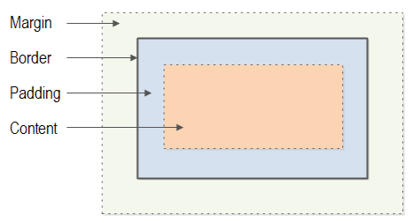
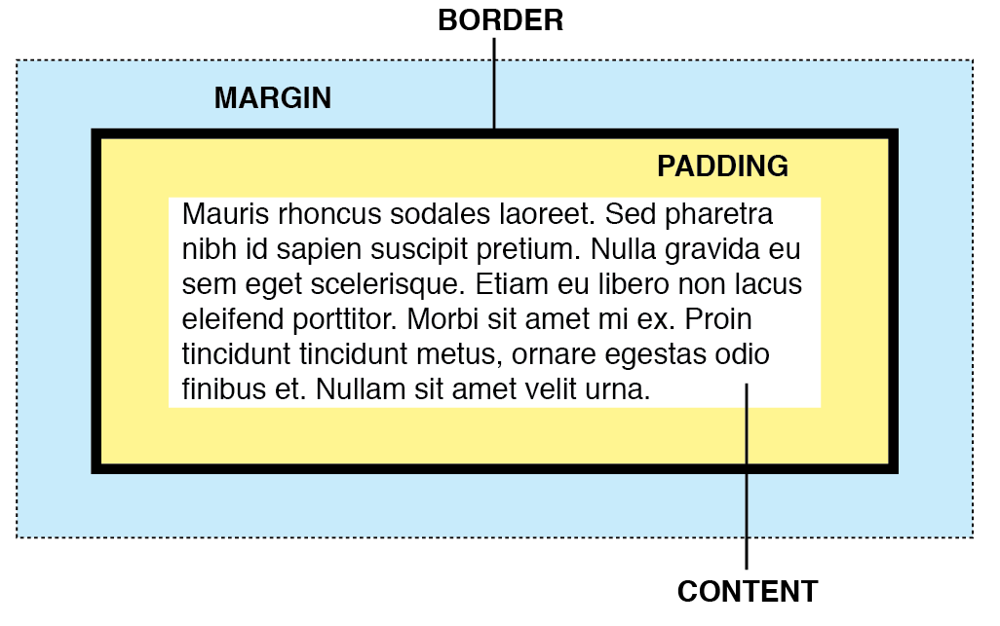

# Módulo 4: CSS Fundamentos

Ahora que dominas HTML, es momento de dar vida visual a tus páginas web. **CSS** (Cascading Style Sheets) es el lenguaje que controla el diseño, los colores, las tipografías y todo el aspecto visual de tu sitio.

## 4.1. ¿Qué es CSS?

!!!note "CSS"
    Es el lenguaje que define la presentación visual de documentos HTML.  
    Mientras HTML estructura el contenido, CSS decide cómo se ve ese contenido: colores, tamaños, espaciados, posiciones y mucho más.

La palabra "Cascading" (en cascada) se refiere a cómo se aplican los estilos: pueden venir de diferentes lugares y algunos tienen más prioridad que otros.

### Cómo vincular CSS

Hay tres formas de añadir CSS a tu HTML.

**1. CSS externo (recomendado)**

**Ventajas:** Reutilizable en múltiples páginas, código organizado, fácil de mantener.

Creas un archivo `.css` separado y lo vinculas al archivo `.html` en la sección `<head>`:

```html title="archivo.html"
<head>
    <link rel="stylesheet" href="styles.css">
</head>
```

```css title="archivo.css"

p {
    color: blue;
}

h2 {
    color: darkred;
    font-size: 24px;    
}
```

Los atributos CSS pueden escribirse en una línea. Aquí tienes un ejemplo de CSS en línea:  

```css title="archivo.css"

p {color: blue; }

h2 {color: darkred; font-size: 24px; }
```

---

**2. CSS interno**

**Cuándo usarlo:** Páginas únicas, prototipos rápidos, estilos muy específicos.

No hace falta crear un archivo `.css`, los estilos se escriben en el archivo `.html` (dentro de la sección`<head>` ) 

```html
<head>
    <style>
        p { color: blue; }
        h2 {color: darkred; font-size: 24px; }
    </style>
</head>
```


***

**3. CSS inline (evitar)**

**Por qué evitarlo:** No es reutilizable, código repetitivo, difícil de mantener.
**Ventaja**: Solo afecta al elemento al que se aplica.

Aplicas estilos directamente en cada elemento:

```css
<p style="color: blue;">Este estilo solo se aplica a este párrafo</p>
<p>A este párrafo no le afecta</p>
```


***

!!! tip "Buena práctica"
    Usa siempre CSS externo en proyectos reales. Separa contenido (HTML) de presentación (CSS).

---


## 4.2. Selectores CSS

Los **selectores** definen *qué elementos HTML recibirán los estilos*.

### Selectores básicos

Los selectores son patrones que le dicen a CSS qué elementos HTML deben recibir los estilos. Son la forma de "apuntar" a los elementos que quieres estilizar.

#### Selector de elemento

Selecciona **todos** los elementos de un tipo específico.

```css title="archivo.css"
p {
    color: blue;
}
/* Todos los párrafos `p` llevarán el color azul. */
h5 {
    color: red;
}
/* Todos los títulos `h5` llevarán el color rojo. */
```

```html title="archivo.html"
<p>Este párrafo será azul.</p>
<p>Este también será azul.</p>
<h2>Esto NO será azul (es un título h2)<h2>
<div>Esto NO será azul (no es un párrafo)</div>
```

**Cuándo usarlo:** Para aplicar estilos generales a **todos** los elementos del mismo tipo (todos los párrafos, todos los h1, etc.).

#### Selector de clase

Selecciona elementos que tienen un atributo o etiqueta `class` específico. Se usa con un punto (`.`) delante del nombre.

Vamos a utilizar la etiqueta o clase (`.class`) para identificar elementos específicos (párrafos, títulos,..) del archivo `.html`. En este caso utilizaremos el nombre `destacado` (podemos utilizar otro nombre).

```css title="archivo.css"
.destacado {
    font-weight: bold;
    background-color: yellow;
}
```

```html title="archivo.html"
<p class="destacado">Este párrafo está etiquetado, entonces, irá en amarillo y negrita.</p>
<p>Este NO está destacado.</p>
<h2 class="destacado">Este títlulo también está etiquetado, entonces, irá en amarillo y negrita.</h2>
```

**Ventajas:**
- ✅ Reutilizable: puedes aplicar la misma clase a múltiples elementos
- ✅ Funciona en cualquier tipo de elemento
- ✅ Un elemento puede tener varias clases: `class="destacado importante"`

**Cuándo usarlo:** Cuando quieres aplicar los mismos estilos a varios elementos que pueden ser de dhtmliferentes tipos.

#### Selector de ID

Selecciona el elemento que tiene un atributo `id` específico. Se usa con almohadilla (`#`) delante del nombre.

```css title="archivo.css"
#principal {
    font-size: 24px;
    color: red;
}
```

```html title="archivo.html"
<h1 id="principal">Este título será rojo y de 24px</h1>
<h1 id="importante">Este es otro título, pero no será rojo ni de 24px</h1>
```

**Importante:**
- ⚠️ El ID debe ser **único** en toda la página (solo un elemento puede tener ese ID)
- Los IDs tienen mayor especificidad que las clases

**Cuándo usarlo:**
- Para elementos únicos en la página
- Para crear anclas de navegación (`<a href="#principal">`)
- Con moderación: generalmente las clases son más flexibles

#### Selector universal

Selecciona **todos** los elementos de la página. Se utiliza el asterico (`*`)

```css title="archivo.css"
* {
    margin: 0;
    padding: 0;
    box-sizing: border-box;
}
```

**Cuándo usarlo:**
- Para resetear estilos por defecto del navegador
- Para aplicar propiedades globales a todos los elementos
- ⚠️ Úsalo con cuidado, puede afectar al rendimiento si abusas de él

***

### Ejemplo práctico completo

=== "Código HTML y CSS"
    ```html title="index.html"
    <h1 id="titulo-principal">Mi Blog</h1>
    <p>Un párrafo normal.</p>
    <p class="destacado">Un párrafo destacado.</p>
    <p class="destacado importante">Otro párrafo con dos clases.</p>
    ```

    ```css title="mi_estilo.css"
    /* Todos los párrafos */
    p {
        line-height: 1.6;
    }

    /* Solo el elemento con id="titulo-principal" */
    #titulo-principal {
        color: navy;
        font-size: 32px;
    }

    /* Todos los elementos con class="destacado" */
    .destacado {
        background-color: yellow;
    }

    /* Todos los elementos con class="importante" */
    .importante {
        font-weight: bold;
        border-left: 4px solid red;
    }
    ```
=== "Renderizado *(haz clic para expandir)*"
    <div>
    <h1 style="color: navy; font-size: 32px;">Mi Blog</h1>
    <p style="line-height: 1.6;">Un párrafo normal.</p>
    <p style="line-height: 1.6; background-color: yellow;">Un párrafo destacado.</p>
    <p style="line-height: 1.6; background-color: yellow; font-weight: bold; border-left: 4px solid red;">Otro párrafo con dos clases.</p>
    </div>

***

!!! tip "Buena práctica"
    - Usa **clases** para la mayoría de tus estilos (son reutilizables)
    - Usa **IDs** solo para elementos únicos
    - Evita el selector universal `*` excepto para resets generales
    - Los nombres de clases e IDs deben ser descriptivos: `.boton-principal` mejor que `.azul`

***


### Combinadores

```
/* Descendiente (cualquier nivel) */
article p {
    line-height: 1.6;
}

/* Hijo directo */
nav > ul {
    list-style: none;
}

/* Hermano siguiente */
h2 + p {
    font-size: 18px;
}
```

### Pseudo-clases

```
/* Al pasar el ratón */
a:hover {
    color: red;
}

/* Primer hijo */
li:first-child {
    font-weight: bold;
}

/* Elementos impares */
tr:nth-child(odd) {
    background: #f5f5f5;
}
```


## 4.3. Colores en CSS

CSS ofrece múltiples formas de definir colores:

```css
/* Nombres de colores */
color: red;
color: blue;

/* Hexadecimal */
color: #FF0000;  /* rojo */
color: #333;     /* gris oscuro */

/* RGB */
color: rgb(255, 0, 0);

/* RGBA (con transparencia) */
color: rgba(255, 0, 0, 0.3);

/* HSL */
color: hsl(0, 100%, 50%);
```

### Colores de fondo

```css
background-color: #f5f5f5;
background-color: rgba(0, 0, 0, 0.1);
```

## 4.4. Tipografía

CSS te permite controlar completamente el aspecto del texto.

### Fuente y tamaño

```css
font-family: Arial, sans-serif;
font-size: 16px;
font-size: 1.2rem;  /* relativo a la raíz */
font-weight: bold;  /* o 400, 700, etc. */
font-style: italic;
```

### Alineación y decoración

```css
text-align: center;
text-align: justify;
text-decoration: underline;
text-decoration: none;  /* quitar subrayado de enlaces */
text-transform: uppercase;
```

### Espaciado

```css
line-height: 1.6;        /* espaciado entre líneas */
letter-spacing: 2px;     /* espaciado entre letras */
word-spacing: 5px;       /* espaciado entre palabras */
```

### Google Fonts

Para usar fuentes personalizadas:

```html title="archivo.html"
<head>
    <link href="https://fonts.googleapis.com/css2?family=Roboto:wght@400;700&display=swap" rel="stylesheet">
</head>
```

```
h1 {
    font-family: 'Roboto', sans-serif;
}
```

---

## 4.5. El modelo de caja (Box Model)

**Todos los elementos HTML** son tratados por el navegador como contenido dentro de dos cajas rectangulares. Todo elemento (`<p>`, `<div>`, `<h1>`, ``, etc.) tiene esta estructura de cajas, llamado **box model** (o modelo de cajas).

Imagina que tienes unos *zapatos* (tu contenido: texto, imagen, botón) que vas a enviar por correo. Para protegerlos, los metes en dos cajas de protección:

  

* **Elemento:** Son tus *zapatos*. En HTML puede ser texto, una imagen, un botón,... cualquier contenido HTML.

* **Content:** Son las *dimensiones de la caja interior* para tus zapatos. En el dibujo superior es el rectángulo naranja.
   
    * Se dimensiona con: `width`y `height`. Por ejemplo: `width= 100px` `height= 30px`.  
  
* **Padding:** Es el *espacio entre dos cajas interiores* que rodea el elemento. Crea "aire" entre las dos cajas de protección. En el dibujo superior es el espacio azul.
    
    * Se pueden dimensionar los cuatro espacios `padding`: `padding-top`, `padding-bottom`, `padding-left` y`padding-right`.

* **Border:** Es el *borde de la caja exterior*. El borde visible del elemento (puede ser invisible si no lo defines). 
   
    * Se pueden definir los cuatros bordes.
   
* **Margin:** Espacio que separa la caja exterior de otras cajas de otros elementos distintos. En el dibujo superior es es espacio verde.

**Todos los párrafos, divs, títulos, etc. siguen este mismo sistema de capas.**



### Ejemplo de box model

=== "Código"
    ```html title="archivo.html"
    <p class=tarjeta>Lorem ipsum dolor sit amet, consectetur adipiscing elit. Maecenas vitae interdum felis. Morbi varius lobortis mi sed aliquam. Donec finibus sapien sem, a scelerisque elit lacinia at.</p>
    ```

    ```css title="archivo.css"
    .tarjeta {
        /* El espacio para el elemento (zapatos) mide 300px  y tendrá un color rosa*/
        width: 300px;  
        background-color: pink;         
        
        /* 20px de espacio interior (burbujas) menos el inferior de 60px */
        padding: 20px;
        padding-bottom: 60px;          
        
        /* Borde azul de 2px y de 4px a puntos el borde inferior (caja de cartón) */
        border: 2px solid blue; 
        border-bottom: 4px dotted;
        
        /* 30px de espacio izquierdo exterior (aire) */
        margin-left: 30px;        
        }
    ```
=== "Renderizado *(clic para expandir)*"
    <div>
    <p style="width: 300px; background-color: pink; padding: 20px; padding-bottom: 60px; border: 2px solid blue; border-bottom: 4px dotted; margin-left: 30px;"> Lorem ipsum dolor sit amet, consectetur adipiscing elit. Maecenas vitae interdum felis. Morbi varius lobortis mi sed aliquam. Donec finibus sapien sem, a scelerisque elit lacinia at.</p>
    </div>

### El problema: content-box (comportamiento por defecto)

Por defecto, cuando dices `width: 300px`, solo estás midiendo el contenido (los zapatos):

```css
.caja {
    width: 300px;         /* Solo los zapatos */
    padding: 20px;        /* + burbujas (40px total) */
    border: 5px solid;    /* + caja (10px total) */
}
```

**Tamaño total real:** 300px + 40px + 10px = **350px** 😞mundo

El elemento ocupa más espacio de lo que esperabas porque las burbujas y la caja también cuentan.

***

### La solución: border-box

Con `box-sizing: border-box`, el `width` incluye todo el paquete (zapatos + burbujas + caja):

```css
* {
    box-sizing: border-box;
}

.caja {
    width: 300px;         /* Todo el paquete */
    padding: 20px;
    border: 5px solid;
}
```

**Tamaño total real:** **300px exactos** ✅

Los zapatos se ajustan automáticamente para que todo quepa en 300px.

***

### Ejemplo con elementos reales

```css
/* Todos los elementos HTML usan el mismo modelo */

p {
    padding: 10px;    /* Espacio alrededor del texto */
    border: 1px solid gray;
    margin: 15px 0;   /* Espacio entre párrafos */
}

.boton {
    padding: 15px 30px;   /* Espacio dentro del botón */
    border: 2px solid blue;
    margin: 10px;         /* Espacio alrededor del botón */
}

img {
    border: 3px solid black;
    padding: 5px;         /* Marco blanco alrededor de la imagen */
    margin: 20px;
}
```

**Todos estos elementos** (`<p>`, `.boton`, ``) siguen el mismo Box Model.

***

### Consejo esencial

Usa esto **siempre** al inicio de tu CSS:

```css
* {
    margin: 0;
    padding: 0;
    box-sizing: border-box;
}
```

Esto aplica `border-box` a **todos los elementos HTML** de tu página, facilitando los cálculos.

***

**Resumen:**
- **Todos los elementos HTML** (`<div>`, `<p>`, ``, `<button>`, etc.) son cajas con 4 capas
- **Content:** el elemento en sí (zapatos)
- **Padding:** espacio interior (burbujas)
- **Border:** borde (caja de cartón)
- **Margin:** espacio exterior (aire entre elementos)
- **`border-box`:** hace que el `width` incluya todo el paquete

***

¿Así está perfecto? Deja claro que TODOS los elementos HTML funcionan así.

```
┌─────────────────────────────────┐
│         Margin (exterior)       │
│  ┌──────────────────────────┐   │
│  │   Border (borde)         │   │
│  │  ┌───────────────────┐   │   │
│  │  │ Padding (relleno) │   │   │
│  │  │  ┌────────────┐   │   │   │
│  │  │  │  Content   │   │   │   │
│  │  │  └────────────┘   │   │   │
│  │  └───────────────────┘   │   │
│  └──────────────────────────┘   │
└─────────────────────────────────┘
```

### Propiedades

```
/* Dimensiones */
width: 300px;
height: 200px;
max-width: 100%;

/* Margen (exterior) */
margin: 20px;
margin: 10px 20px;           /* vertical horizontal */
margin: 10px 20px 30px 40px; /* top right bottom left */
margin: 0 auto;              /* centrar horizontalmente */

/* Relleno (interior) */
padding: 20px;
padding-top: 10px;

/* Borde */
border: 2px solid #333;
border-radius: 10px;  /* esquinas redondeadas */

/* Sombra */
box-shadow: 0 2px 4px rgba(0,0,0,0.1);
```

### Box-sizing

```
/* Recomendado para todos los elementos */
* {
    box-sizing: border-box;
}
```

Con `border-box`, el `width` incluye padding y border, facilitando los cálculos.

---

## 4.6. Display y visibilidad

```
/* Display */
display: block;        /* Ocupa todo el ancho */
display: inline;       /* En línea con el texto */
display: inline-block; /* En línea pero con dimensiones */
display: none;         /* Oculto (no ocupa espacio) */

/* Visibilidad */
visibility: hidden;    /* Oculto pero sí ocupa espacio */
visibility: visible;
```

---
<!-- 
## 📝 Resumen

En este módulo has aprendido:

- Qué es CSS y cómo vincularlo a HTML
- Selectores básicos, combinadores y pseudo-clases
- Cómo aplicar colores y trabajar con tipografía
- El modelo de caja y sus propiedades
- Display y visibilidad

---

## 🎯 Ejercicios

Ver [Ejercicios CSS Básico](../ejercicios/css-basico.md)

---

## ➡️ Siguiente módulo

[Módulo 05: CSS  Introducción](05-css-layout.md) - Flexbox, Grid y diseño responsive
```

*** -->