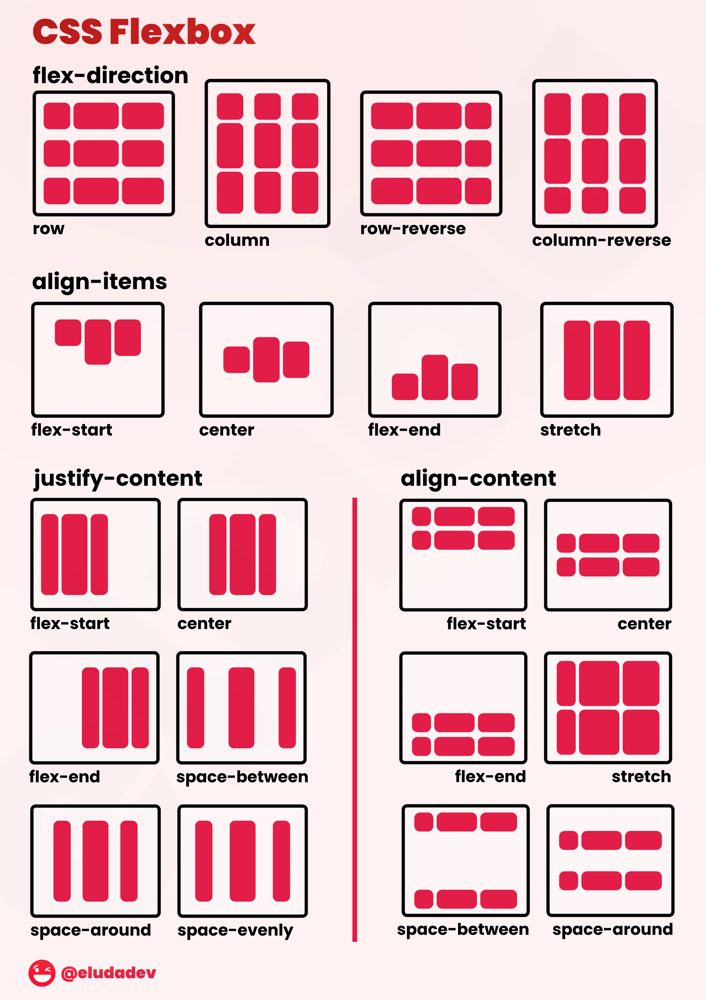

# Modulo 5.3: Flexbox
[TOC]
!!!note "Flexbox"
    **Flexbox** es un sistema de diseño en CSS que facilita la organización, alineación y distribución del espacio entre elementos dentro de un contenedor.  
    Está pensado para trabajar en **una sola dimensión**: en fila (horizontal) **o** columna (vertical).

## ¿Por qué usar Flexbox?

- Hace sencillo **alinear elementos tanto en vertical como en horizontal**.
- **Controla el espacio y orden de los elementos** sin depender de floats ni posiciones complicadas.- Permite crear layouts responsivos y adaptables fácilmente.
- Permite crear layouts responsivos y adaptables fácilmente.
- Facilita la creación de barras de navegación, grids simples y tarjetas alineadas.

> Debido a la amplia variedad de posibilidades que ofrece la herramienta Flexbox, resulta imposible abordarlas todas en este curso. Por ello, se proporcionan a continuación una serie de recursos que permiten profundizar en su estudio.  
  * [Tutorial interactivo de CSS Flexbox](https://ghosttogether.net/tutorial/css/flex-tutorial){:target="_blank"}      
  * [The Complete CSS Flex Box Tutorial](https://ghost-together.medium.com/the-complete-css-flex-box-tutorial-d17971950bdc){:target="_blank"}  

  

## Elementos de Flexbox 

Los dos elementos principales de flexbox son:   
{width="50%" align="right"}  
- **CONTENEDOR (flex container):**  
  Es el elemento al que se le aplica `display: flex;`. Es el "padre" que contiene a varios *ítems* y controla el comportamiento del layout.  
- **ÍTEMs (flex item):**  
  Cada Ítem 1 de los elementos hijos directos dentro del contenedor flex. Son los "hijos" que se distribuyen y alinean según las reglas del contenedor flex. 

> Podemos asimilar el **contenedor** como una *caja grande* en la que vamos a introducir varias *cajas pequeñas* (**ítems**). Estas cajas pequeñas podemos disponerlas dentro de la grande de varias maneras (centradas, a la izquierda, que ocupen toda la caja grande, arrimadas a la parte de arriba...)
{width="50%" align="right"}

## Propiedades del Contenedor

- `display: flex;` — Activa flexbox.  
  - `flex-direction` — Define la dirección: `row` (por defecto) o `column`.  
  - `justify-content` — Alinea los elementos en el eje principal: inicio, centro, final, espacio entre/ alrededor/ etc.  
  - `align-items` — Alinea en el eje secundario: arriba, centro, abajo, stretch.  
  - `flex-wrap` — Permite que los elementos salten a otra línea si no caben.  

## Propiedades para los hijos (Ítems)

- `flex-grow` — Hace que un elemento crezca para rellenar espacio.
- `flex-shrink` — Permite al elemento encogerse si es necesario.
- `flex-basis` — Tamaño base del ítem.
- `order` — Cambia el orden visual de un ítem.
- `align-self` — Alinea individualmente un solo ítem.

## Ejemplo básico

=== "| HTML |"
    ```html linenums="1" hl_lines="2 3 4 5 6"
    ...
    <div class="contenedor">
        <div class="elemento">Ítem 1</div>
        <div class="elemento">Ítem 2</div>
        <div class="elemento">Ítem 3</div>
    </div>
    ...
    ```
=== "| CSS 1"
    ```css linenums="1" hl_lines="3 4 11"
    ...
    <style>
    .contenedor {
        display: flex;
        justify-content: center;
        align-items: center;
        gap: 20px;
        height: 150px;
        background: #f9e2e2ff;
    }
    .elemento {
        background: #379;
        color: #fff;
        padding: 20px 40px;
        font-size: 1.2em;
        border-radius: 8px;
    }
    </style>
    ...
    ```
=== "Resultado 1|"
    <p>Los tres elementos están alineados en el centro del contenedor, en fila y con espacio entre ellos.</p>
    <style>
    .contenedor {
        display: flex;
        justify-content: center;
        align-items: center;
        gap: 20px;
        height: 150px;
        background: #f9e2e2ff;
        border: 2px solid navy;
    }
    .elemento {
        background: #379;
        color: #fff;
        padding: 20px 40px;
        font-size: 1.2em;
        border-radius: 8px;
    }
    </style>
    <div class="contenedor">
        <div class="elemento">Ítem 1</div>
        <div class="elemento">Ítem 2</div>
        <div class="elemento">Ítem 3</div>
    </div>

=== "| CSS 2"
    ```css linenums="1" hl_lines="4 5"
    ...
    <style>
    .contenedor {
        display: flex;
        justify-content: start;
        align-items: center;
        gap: 20px;
        height: 150px;
        background: #f9e2e2ff;
    }
    .elemento {
        background: #379;
        color: #fff;
        padding: 20px 40px;
        font-size: 1.2em;
        border-radius: 8px;
    }
    </style>
    ...
    ```

=== "Resultado 2 |"
    <p>Los tres elementos están alineados al principio del contenedor, en fila y con espacio entre ellos.</p>
    <style>
    .contenedor2 {
        display: flex;
        justify-content: start;
        align-items: center;
        gap: 20px;
        height: 150px;
        background: #f9e2e2ff;
        border: 2px solid navy;
    }
    .elemento2 {
        background: #379;
        color: #fff;
        padding: 20px 40px;
        font-size: 1.2em;
        border-radius: 8px;
    }
    </style>
    <div class="contenedor2">
        <div class="elemento2">Ítem 1</div>
        <div class="elemento2">Ítem 2</div>
        <div class="elemento2">Ítem 3</div>
    </div>
=== "| CSS 3"
    ```css linenums="1" hl_lines="3 4 5 6"
    ...
    <style>
    .contenedor {
        display: flex;
        justify-content: space-evenly;
        align-items: stretch;
        gap: 20px;
        height: 150px;
        background: #f9e2e2ff;
    }
    .elemento {
        background: #379;
        color: #fff;
        padding: 20px 40px;
        font-size: 1.2em;
        border-radius: 8px;
    }
    </style>
    ...
    ```

=== "Resultado 3 |"
    <p>Los tres elementos están alineados al centro del contenedor, con espacio máximo entre ellos en el eje principal y estirados en el eje secundario.</p>
    <style>
    .contenedor3 {
        display: flex;
        justify-content: space-evenly;
        align-items: stretch;
        gap: 20px;
        height: 150px;
        background: #f9e2e2ff;
        border: 2px solid navy;
    }
    .elemento3 {
        background: #379;
        color: #fff;
        padding: 20px 40px;
        font-size: 1.2em;
        border-radius: 8px;
    }
    </style>
    <div class="contenedor3">
        <div class="elemento3">Ítem 1</div>
        <div class="elemento3">Ítem 2</div>
        <div class="elemento3">Ítem 3</div>
    </div>

## ¿Para qué sirve flexbox?

- Menús horizontales y verticales.
- Cards alineadas.
- Layout de imágenes.
- Centrado de contenido en cualquier dirección.
- Repartir el espacio sobrante o ajustar elementos automáticamente.

**Consejo:**  
Flexbox es ideal para layouts lineales; para estructuras en 2 dimensiones (filas y columnas a la vez), usa mejor CSS Grid.